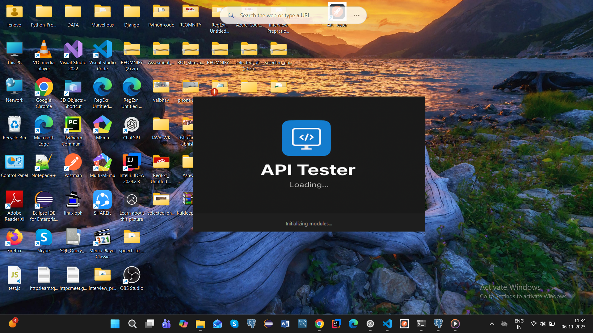
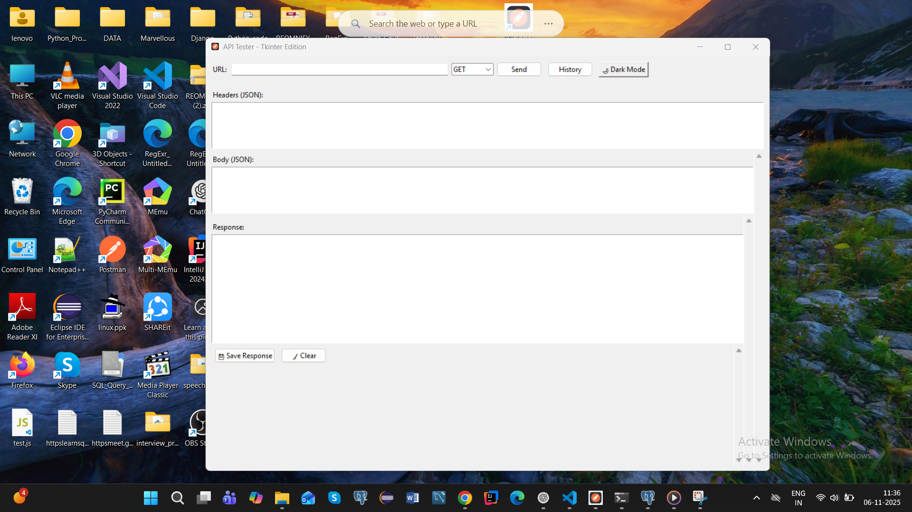
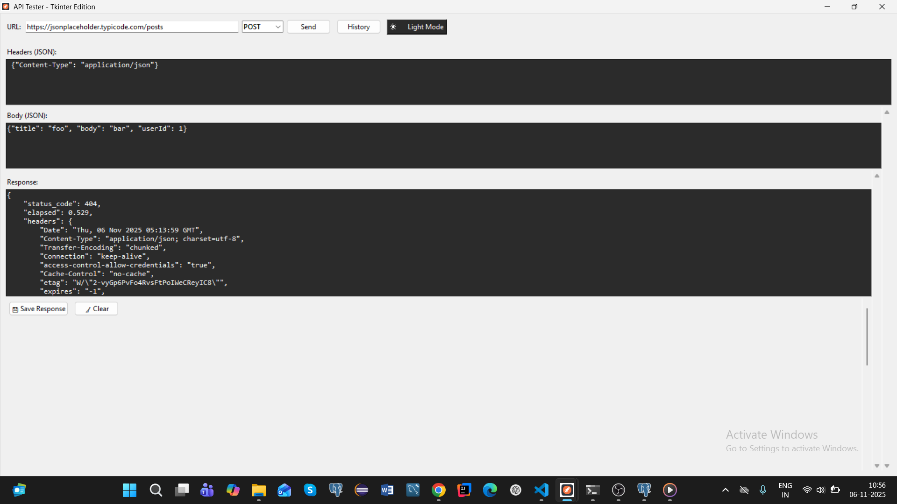
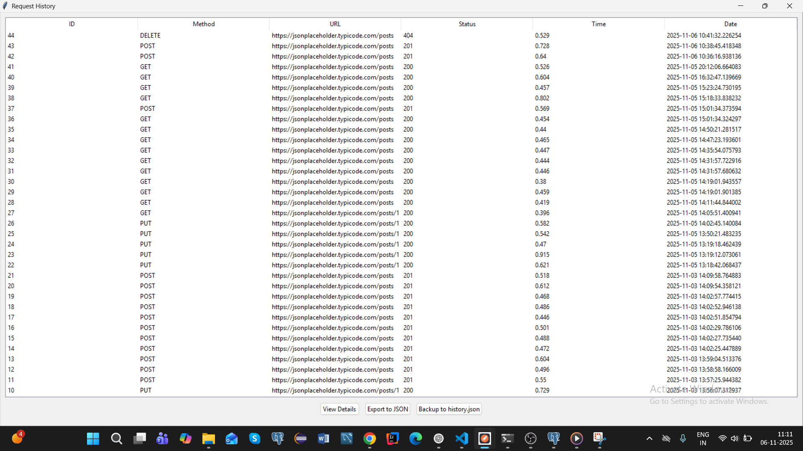
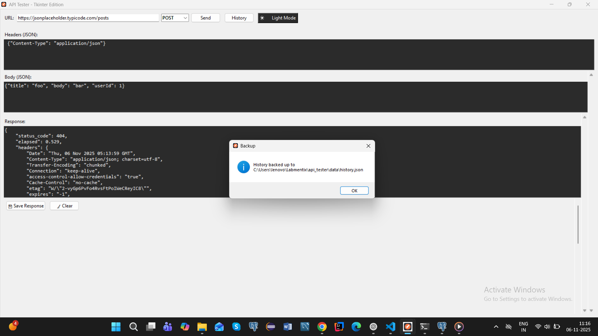
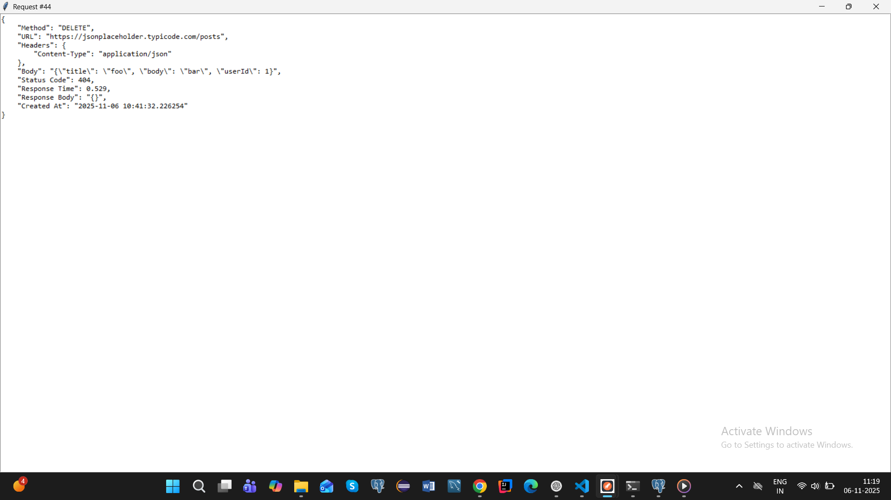
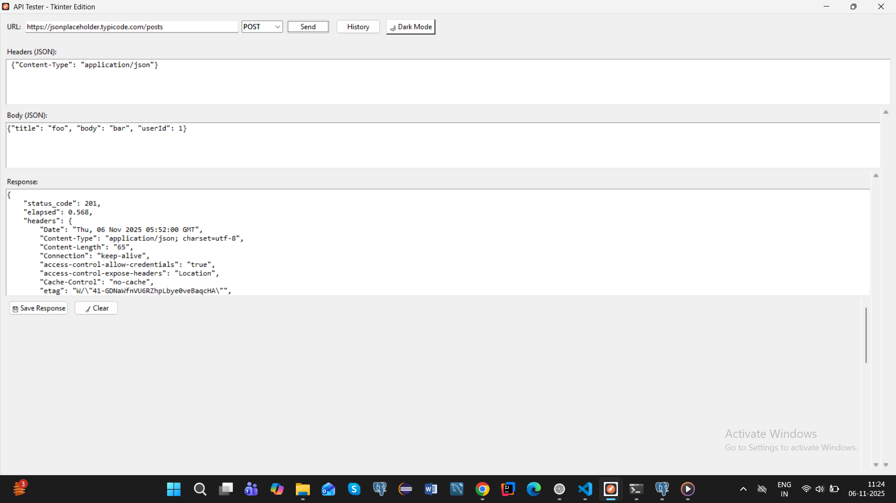
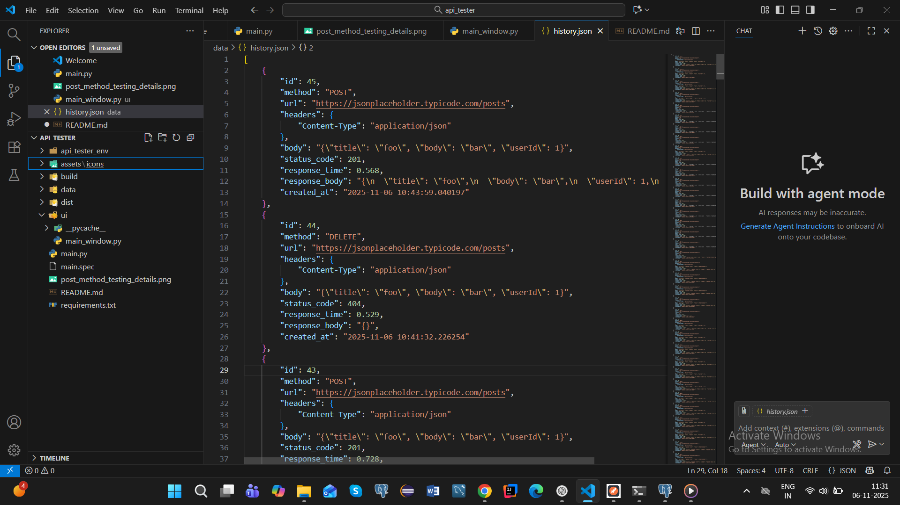
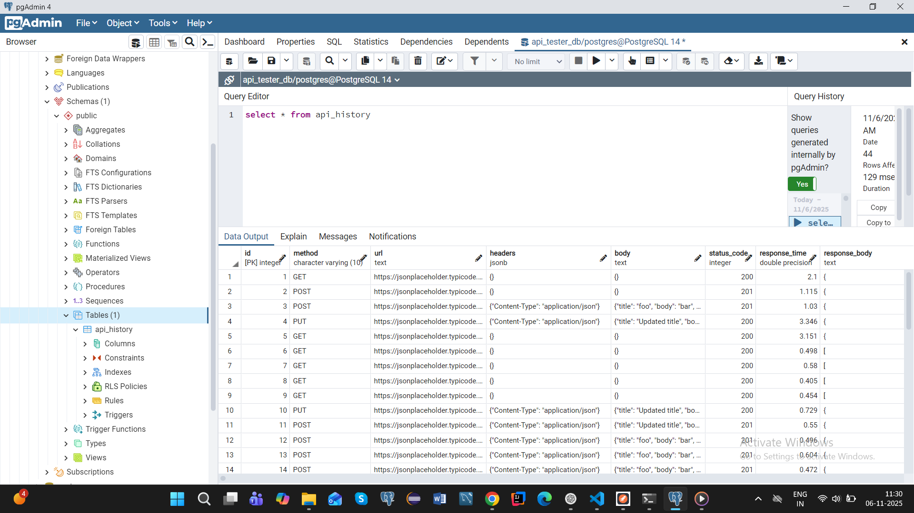

# API Tester (Tkinter + PostgreSQL)

A lightweight Postman-like API tester built with Python.

## Features
- Test APIs with GET, POST, PUT, DELETE
- Add custom headers and body (JSON)
- View status, response, headers, and time
- Store history in PostgreSQL
- Tkinter-based clean GUI

## Installation
```bash
git clone <repo_url>
cd api_tester
python -m venv api_tester_env
api_tester_env\Scripts\activate
pip install -r requirements.txt


## 🖼️ App Preview












## 🎬 Project Demo
[🎥Watch the video presentation on Google Drive](https://drive.google.com/file/d/1OikUuc_4VLnR1Pw9n4G756wmWSpdHo07/view?usp=drive_link)
